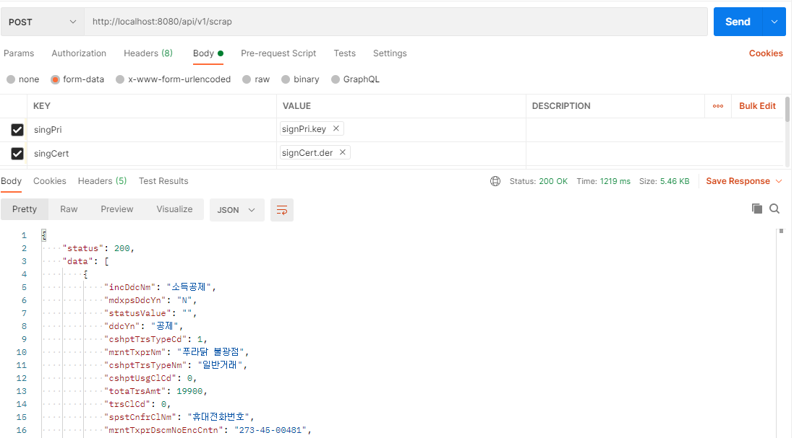

# :loudspeaker: REST API 를 이용하여 홈택스 데이터 제공(V1)
업무를 하다보면 연계 시스템쪽에 데이터를 전달해줘야할 때가 있다.  
보통 JSON 형식의 데이터로 전달을 하게 되는데 이전에 만든 홈택스 스크래핑을 이용하여 간단하게 구현해보았다.  

``` java
@RestController
@RequiredArgsConstructor
@Slf4j
public class HomeTaxApiController extends CustomExceptionHandler {

    private final ScrapService service;

    // 스크래핑 데이터를 저장하지 않고 직접 데이터 받아오기
    @RequestMapping(value = "/api/v1/scrap" , method = RequestMethod.POST)
    public Result scrapV1(RequestSignData request) throws Exception {
        List<HashMap<String, Object>> result = service.scrapDirectCall(request);
        return new Result(200 ,result.stream().map(ScrapDataDto::new).collect(Collectors.toList()));
    }


    @Data
    @AllArgsConstructor
    static class Result<T> {
        private int status;
        private T data;
    }

    // 리턴해줄 데이터 셋
    @Data
    public class ScrapDataDto {

        private String incDdcNm;
        private String mdxpsDdcYn;
        private String statusValue;
        private String ddcYn;
        private Integer cshptTrsTypeCd;
        private String mrntTxprNm;
        private String cshptTrsTypeNm;
        private Integer cshptUsgClCd;
        private Integer totaTrsAmt;
        private Integer trsClCd;
        private String spstCnfrClNm;
        private String mrntTxprDscmNoEncCntn;
        private String aprvNo;
        private String trsClNm;
        private String spstCnfrClCd;
        private String rcprTin;
        private Integer trsTime;
        private Integer spstCnfrPartNo;
        private Long cshptMrntTin;
        private String trsDtTime;
        private Integer id;
        private Integer trsDt;
        private String incDdcYn;

        public ScrapDataDto(HashMap<String, Object> o) {

            this.rcprTin = o.get("rcprTin").toString();
            this.incDdcNm = o.get("incDdcNm").toString();
            this.mdxpsDdcYn = o.get("mdxpsDdcYn").toString();
            this.statusValue = o.get("statusValue").toString();
            this.ddcYn = o.get("ddcYn").toString();
            this.cshptTrsTypeCd = Integer.parseInt(o.get("cshptTrsTypeCd").toString());
            this.mrntTxprNm = o.get("mrntTxprNm").toString();
            this.cshptTrsTypeNm = o.get("cshptTrsTypeNm").toString();
            this.cshptUsgClCd = Integer.parseInt(o.get("cshptUsgClCd").toString());
            this.totaTrsAmt = Integer.parseInt(o.get("totaTrsAmt").toString());
            this.trsClCd = Integer.parseInt(o.get("trsClCd").toString()) ;
            this.spstCnfrClNm = o.get("spstCnfrClNm").toString();
            this.mrntTxprDscmNoEncCntn = o.get("mrntTxprDscmNoEncCntn").toString();
            this.aprvNo = o.get("aprvNo").toString();
            this.trsClNm = o.get("trsClNm").toString();
            this.spstCnfrClCd = o.get("spstCnfrClCd").toString();
            this.trsTime = Integer.parseInt(o.get("trsTime").toString());
            this.spstCnfrPartNo = Integer.parseInt(o.get("spstCnfrPartNo").toString());
            this.cshptMrntTin = Long.valueOf(o.get("cshptMrntTin").toString());
            this.trsDtTime = o.get("trsDtTime").toString();
            this.id = Integer.parseInt(o.get("id").toString());
            this.trsDt = Integer.parseInt(o.get("trsDt").toString());
            this.incDdcYn = o.get("incDdcYn").toString();
        }
    }
}


public class RequestSignData {

    // 공인인증서 개인키 파일
    private MultipartFile singPri;

    // 공인인증서 공개키 파일
    private MultipartFile singCert;

    // 공인인증서 패스워드
    private String signPassword;

    // 홈택스 스크래핑할 타입 [TEET] 전자세금계산서 / [TECR] 현금영수증
    private String scrapType;

    // 검색 기간
    private String start_dt;
    private String end_dt;

    // 필수값 검증 편의 메소드
    public void hashError() throws HomeTaxException {
        
        if (singPri.isEmpty()) {
            throw new HomeTaxException(ErrorCode.SIGN_PRI_NOT_FOUND);
        }else if(singCert.isEmpty()){
            throw new HomeTaxException(ErrorCode.SIGN_CERT_NOT_FOUND);
        }else if(signPassword == null || signPassword.trim().equals("")){
            throw new HomeTaxException(ErrorCode.PASSWORD_NOT_FOUND);
        }else if(!singPri.getOriginalFilename().endsWith(".key")){
            throw new HomeTaxException(ErrorCode.SIGN_PRI_EXTENSION_ERROR);
        }else if(!singCert.getOriginalFilename().endsWith(".der")){
            throw new HomeTaxException(ErrorCode.SIGN_CERT_EXTENSION_ERROR);
        }else if(start_dt == null || start_dt.trim().equals("")){
            throw new HomeTaxException(ErrorCode.SEARCH_START_DATE);
        }else if(end_dt == null || end_dt.trim().equals("")){
            throw new HomeTaxException(ErrorCode.SEARCH_START_DATE);
        }
    }
}

```
RestApi 를 구현할때 엔티티 혹은 데이터 셋을 그대로 반환하는것은 좋지 않다.   
그렇기 때문에 따로 DTO 형식의 데이터셋을 만들어 반환하게 코딩 하였다. :v:   

POSTMAN 을 통하여 테스트를 진행하였는데 아래와 같이 내가 2만원주고 사먹은 푸라닭 데이터가 정상적으로   
들어온것을 확인 할 수 있다. 나는 사업자가 아니기에 매입매출 세금계산서는 조회할 수 있는 권한이 없기에   
현금영수증 데이터를 조회하여 사용했다.

