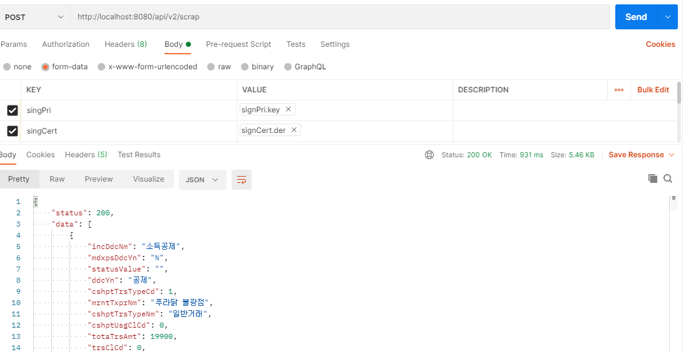
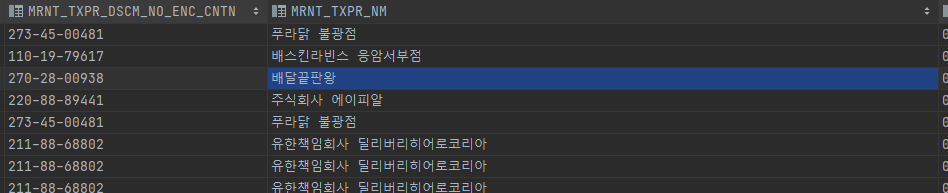

# :loudspeaker: REST API 를 이용하여 홈택스 데이터 제공(V2)

저번 V1 호출 편에서는 직접 데이터를 제공해주는 방식으로 코딩하였다.  
V2는 Spring Data JPA를 이용하여 간단하게 데이터 베이스에 저장 후 데이터를 제공해주는 방식으로 코딩하였다.   
코드는 지난 V1과 거의 유사하여 바뀐 부분만 표현하였다.

@RequiredArgsConstructor 어노테이션을 통해 불필요한 코딩을 제거하였다.   
RequiredArgsConstructor 를 사용하면 @Autowired 등을 대신하여 final 을 사용하면 자동으로 프레임워크에서 지원을 해준다.
``` java
// 스크래핑 데이터를 데이터베이스에 저장 후 데이터 받아오기
@RequestMapping(value = "/api/v2/scrap" , method = RequestMethod.POST)
public Result scrapV2(RequestSignData request) throws Exception {
    List<HashMap<String, Object>> result = service.scrapV2(request);
    return new Result(200 , result.stream().map(ScrapDataDto::new).collect(Collectors.toList()));
}

@RequiredArgsConstructor
@Service
public class ScrapService {

    private final SignDecr signDecr;
    private final HomeTaxLogin homeTaxLogin;
    private final EntityManager em;
    private final ScrapRepository scrapRepository;

    public List<HashMap<String, Object>> scrapDirectCall(RequestSignData request) throws Exception{

        // 필수값 검증 편의 메소드
        request.hashError();

        HashMap<String, String> sign = signDecr.sign(request);
        HashMap<String, String> login = homeTaxLogin.login(sign);
        List<HashMap<String, Object>> result = homeTaxLogin.scrap(login, request);

        return result;
    }

    @Transactional
    public List<HashMap<String, Object>> scrapV2(RequestSignData request) throws Exception {
        List<HashMap<String, Object>> result = scrapDirectCall(request);
        for (HashMap<String, Object> scrapItem : result) {
            Optional<Scrap> findScrap = scrapRepository.findById(scrapItem.get("aprvNo").toString());
            if (findScrap.isPresent()) {
                // 기존에 해당 데이터가 이미 스크래핑 되어 수집되어 있는 상태라면 값만 업데이트 해준다.
                findScrap.get().updateScrapData(scrapItem);
            }else{
                // 신규 데이터 이므로 데이터를 추가하여줌.
                Scrap newScrap = new Scrap();
                newScrap.createScrapData(scrapItem);
                em.persist(newScrap);
            }
        }
        return result;
    }

}

```
   
아래는 Entity 작성 부분인데 Entity 룰 작성할때엔 추후 유지보수성을 높히기 위해 최대한 Setter를 제거하고   
필요시 편의 메소드를 작성함으로써 관리를 해주어야한다.   
물론 프로그램이 가볍거나 정말 단순한 로직밖에 없으면 굳이 이렇게 해주지 않아도 되지만
개발에 있어선 무조건이란 단어는 없다. 언제 프로그램이 바뀔지 모르기때문에 Setter 를 사용하지 않는것을 원칙으로한다.

``` java
@Entity
@RequiredArgsConstructor
@Getter
@Table(name = "scrap_data")
public class Scrap {

    // 승인번호 이므로 Primary Key 로 지정
    @Id
    private String aprvNo;

    private String incDdcNm;
    private String mdxpsDdcYn;
    private String statusValue;
    private String ddcYn;
    private Integer cshptTrsTypeCd;
    private String mrntTxprNm;
    private String cshptTrsTypeNm;
    private Integer cshptUsgClCd;
    private Integer totaTrsAmt;
    private Integer trsClCd;
    private String spstCnfrClNm;
    private String mrntTxprDscmNoEncCntn;
    private String trsClNm;
    private String spstCnfrClCd;
    private String rcprTin;
    private Integer trsTime;
    private Integer spstCnfrPartNo;
    private Long cshptMrntTin;
    private String trsDtTime;
    private Integer id;
    private Integer trsDt;
    private String incDdcYn;

    // 신규 데이터 입력시 사용될 편의 메소드
    public void createScrapData(HashMap<String, Object> o) {

        this.aprvNo = o.get("aprvNo").toString();
        this.rcprTin = o.get("rcprTin").toString();
        this.incDdcNm = o.get("incDdcNm").toString();
        this.mdxpsDdcYn = o.get("mdxpsDdcYn").toString();
        this.statusValue = o.get("statusValue").toString();
        this.ddcYn = o.get("ddcYn").toString();
        this.cshptTrsTypeCd = Integer.parseInt(o.get("cshptTrsTypeCd").toString());
        this.mrntTxprNm = o.get("mrntTxprNm").toString();
        this.cshptTrsTypeNm = o.get("cshptTrsTypeNm").toString();
        this.cshptUsgClCd = Integer.parseInt(o.get("cshptUsgClCd").toString());
        this.totaTrsAmt = Integer.parseInt(o.get("totaTrsAmt").toString());
        this.trsClCd = Integer.parseInt(o.get("trsClCd").toString()) ;
        this.spstCnfrClNm = o.get("spstCnfrClNm").toString();
        this.mrntTxprDscmNoEncCntn = o.get("mrntTxprDscmNoEncCntn").toString();
        this.trsClNm = o.get("trsClNm").toString();
        this.spstCnfrClCd = o.get("spstCnfrClCd").toString();
        this.trsTime = Integer.parseInt(o.get("trsTime").toString());
        this.spstCnfrPartNo = Integer.parseInt(o.get("spstCnfrPartNo").toString());
        this.cshptMrntTin = Long.valueOf(o.get("cshptMrntTin").toString());
        this.trsDtTime = o.get("trsDtTime").toString();
        this.id = Integer.parseInt(o.get("id").toString());
        this.trsDt = Integer.parseInt(o.get("trsDt").toString());
        this.incDdcYn = o.get("incDdcYn").toString();
    }

    // 기존 데이터가 있을경우 업데이트 진행해주는 편의메소드
    public void updateScrapData(HashMap<String, Object> o) {

        // 승인번호는 Primary Key 이므로 업데이트를 해주지 않는게 원칙.
        // this.aprvNo = o.get("aprvNo").toString();

        this.rcprTin = o.get("rcprTin").toString();
        this.incDdcNm = o.get("incDdcNm").toString();
        this.mdxpsDdcYn = o.get("mdxpsDdcYn").toString();
        this.statusValue = o.get("statusValue").toString();
        this.ddcYn = o.get("ddcYn").toString();
        this.cshptTrsTypeCd = Integer.parseInt(o.get("cshptTrsTypeCd").toString());
        this.mrntTxprNm = o.get("mrntTxprNm").toString();
        this.cshptTrsTypeNm = o.get("cshptTrsTypeNm").toString();
        this.cshptUsgClCd = Integer.parseInt(o.get("cshptUsgClCd").toString());
        this.totaTrsAmt = Integer.parseInt(o.get("totaTrsAmt").toString());
        this.trsClCd = Integer.parseInt(o.get("trsClCd").toString()) ;
        this.spstCnfrClNm = o.get("spstCnfrClNm").toString();
        this.mrntTxprDscmNoEncCntn = o.get("mrntTxprDscmNoEncCntn").toString();
        this.trsClNm = o.get("trsClNm").toString();
        this.spstCnfrClCd = o.get("spstCnfrClCd").toString();
        this.trsTime = Integer.parseInt(o.get("trsTime").toString());
        this.spstCnfrPartNo = Integer.parseInt(o.get("spstCnfrPartNo").toString());
        this.cshptMrntTin = Long.valueOf(o.get("cshptMrntTin").toString());
        this.trsDtTime = o.get("trsDtTime").toString();
        this.id = Integer.parseInt(o.get("id").toString());
        this.trsDt = Integer.parseInt(o.get("trsDt").toString());
        this.incDdcYn = o.get("incDdcYn").toString();
    }

}
```   
V2도 POSTMAN으로 테스트 해보자   



내가 열심히 시켜먹거나 주문했던 인터넷 내역이 정상적으로 데이터베이스에 저장된것을 확인할 수 있다. :sunglasses:



