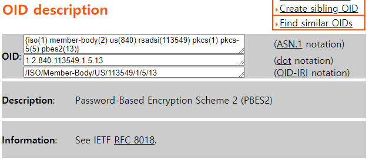
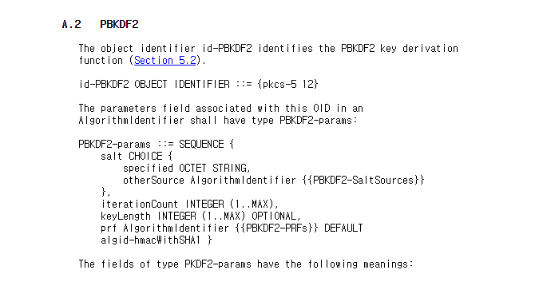
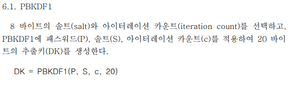
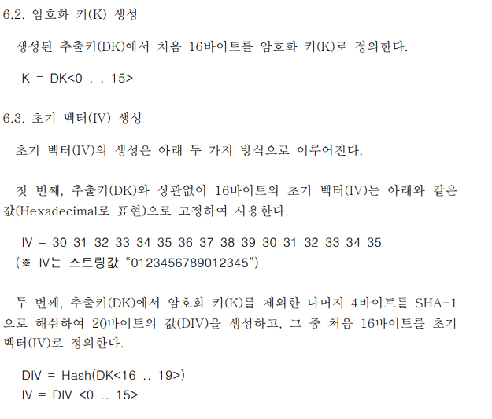

# :loudspeaker: 공인인증서 복호화

# :bulb: 공인인증서 Private Key 추출
홈택스에 공인인증서로 로그인하기 위하여 공인인증서 파일의 내용을 활용하여  
전자서명을 하고개인키(signPri.key)를 자바의 PrivateKey 객체로 변환해서 사용해야 한다.  
현재 우리나라 공인인증서의 개인키는 KISA에서 권고하는 SEED 방식으로  
암호화 되어 있기 때문에 일반적인 방법으로는 개인키를 PrivateKey 객체로 얻을 수 없다.  
그리고 개인키의 종류는 개인과 법인으로 나뉘며 발급기관에 따라서 암호화 되어 있는   
데이터를 풀 수 있는 키를 얻는 방법이 다르다.   
공인인증서를 PrivateKey 변환하는 내용은 검색을 해보면 많은 자료들이 있다.  
이 중 공인인증서는 ASN.1 이라는 구조로 저장되어 있는데 자바의 ASN1InputStream으로  
개인키의 내용을 읽어서 확인할 수 있는데 내용을 읽어보면 “1.2.840.113549.1.5.13”   
같은 이상한 숫자들을 볼 수 있는데 이것이 암호화 알고리즘을 지칭한다.  

# PKCS5PBES2 방식의 암호화 알고리즘

암호화 알고리즘 방식을 객체 식별자(OID) 라고도 말하는데   
http://oid-info.com/get/1.2.840.113549.1.5.13  
이 사이트에 들어가서 확인을 해보면 아래 사진처럼 정보가 나오는것을 확인할 수 있다.  
그리고 설명란에 작성되어있는것을 해석 해보면 “1.2.840.113549.1.5.13” 는  
PKCS5 형식의 PBES2 으로 암호화 되어있다고 알려주고 있다.  

    
이제 PBES2 에 대해 알 수 있는 https://tools.ietf.org/html/rfc2898#appendix-A.2   
사이트를 들어가보면   

개인키 암호화에 사용된 salt 값과 iterationCount, keyLength가 들어가 있는 구조라고   
알 수 있다. OCTET STRING 값이 salt가 되고, INTEGER이 iterationCount로   
사용한다고 한다. ASN1Sequence 객체로 데이터를 받아보면   
복호화 수행에 필요한 salt, IC, IV 모두 얻어낼수 있다.   

#   seedCBCWithSHA1 방식의 암호화 알고리즘
PKCS5PBES2 방식과 다르게 seedCBCWithSHA1 방식의 규칙은 복호화 키와 IV값을 얻어내기 위해   
아래 레퍼런스를 참고해야한다.  
https://rootca.kisa.or.kr/kcac/down/TechSpec/2.3-Encryption%20Algorithm%20Scheme%20Specification.pdf  

해당 PDF 파일을 열어보면    

복호화 키를 얻기 위해서는 20 바이트의 추출 키를 생성해야 한다고 명시되어 있다.  

IV 초기 벡터값을 얻는 방식또한 다르다.  

    
    
    

