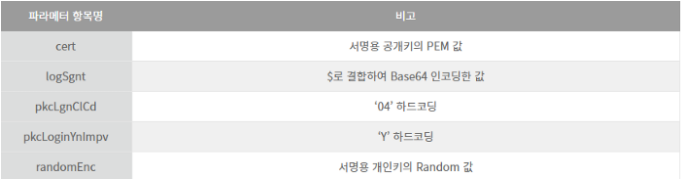
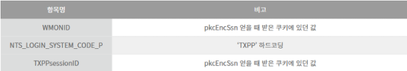

# :loudspeaker: 공인인증서 전자서명
공인인증서의 PrivateKey 객체를 이용하여 전자서명을 진행을 해보자. :grin:  

전자 서명을 하기전에 미리 홈택스에서 전자서명을 할 문자열과 쿠키 정보를 수집해와야하는데  
https://www.hometax.go.kr/wqAction.do?actionId=ATXPPZXA001R01&screenId=UTXPPABA01  
위 URL 을 통해 WMONID , TXPPsessionID , pkcEncSsn 세개 의 값을 가져와야한다.  

그리고 전자서명에 사용할 문자열 pkcEncSsn 값과 나중에 홈택스 공인인증서 로그인에   
보낼 쿠키값 WMONID , TXPPsessionID 두개를 얻었다면 전자 서명을 시작해보자.  


``` java
public HashMap<String, String> sign(RequestSignData requestSignData) throws Exception {

    byte[] privateKeyByte = getDecryptedKey(requestSignData);
    X509Certificate certificate = getCertificate(requestSignData);
    Date date = new Date();
    SimpleDateFormat sdf = new SimpleDateFormat("yyyyMMddHHmmss");
    String toDay = sdf.format(date);

    // 개인키
    PrivateKey privateKey = getPrivateKey(privateKeyByte);

    // 공개키
    PublicKey publicKey = certificate.getPublicKey();

    // 개인키 신원확인 키 값
    String privateRandomValue = getIdentityCheck(requestSignData);

    // 서명용 문자열과 쿠키 정보들을 가져옴
    JSONObject signTextInfo = getSignText();

    String msg = signTextInfo.get("pkcEncSsn").toString();

    Signature signaturePrivate = Signature.getInstance("SHA256withRSA");//SHA256withRSA

    signaturePrivate.initSign(privateKey);

    signaturePrivate.update(msg.getBytes());

    byte[] sign = signaturePrivate.sign();

    String msgB = msg;

    Signature signaturePublic = Signature.getInstance("SHA256withRSA");

    signaturePublic.initVerify(publicKey);

    signaturePublic.update(msgB.getBytes());

    // 전자서명 정상 여부 검증
    boolean verifty = signaturePublic.verify(sign);

    String certPem = "-----BEGIN CERTIFICATE-----" + Base64.getEncoder().encodeToString(certificate.getEncoded()) + "-----END CERTIFICATE-----";
    String logSgnt = signTextInfo.get("pkcEncSsn").toString() + "$" + certificate.getSerialNumber() + "$" + toDay + "$" + Base64.getEncoder().encodeToString(sign) ;
    logSgnt = Base64.getEncoder().encodeToString( logSgnt.getBytes() );
    HashMap<String, String> param = new HashMap<String, String>();

    param.put("cert", certPem);
    param.put("logSgnt", logSgnt); //서명으로 사용할 문자열 + $ + 서명용공개키 인증서 일렬번호 + $ + yyyyMMddHHmmss + $ + 전자서명한 값
    param.put("pkcLgnClCd", "04");
    param.put("pkcLoginYnImpv", "Y");
    param.put("randomEnc",privateRandomValue);
    param.put("pkcEncSsn",signTextInfo.get("pkcEncSsn").toString());
    param.put("WMONID",signTextInfo.get("WMONID").toString());
    param.put("TXPPsessionID",signTextInfo.get("TXPPsessionID").toString());
    param.put("NTS_LOGIN_SYSTEM_CODE_P", "TXPP");

    return param;
}
```
전자 서명을 하였다면 이제 추가로 홈택스 연동에 필요한 값을 만들어야하는데   
1.서명할 원본 값(pkcEncSsn)   
2.서명용 공개키에서 얻은 인증서 일련번호  
3.pkcEncSsn 값을 전자서명한 값  
4.서명용 공개키에서 얻은 PEM 타입의 인증서 문자열  
5.서명용 개인키에서 얻은 Random 값  

위의 다섯개의 드래곤볼이 필요하다.  
1번째 항목은 전자서명을 진행하기전 홈택스 URL을 통해 얻어왔으며  
2번째는 공인인증서에는 두가지의 종류가 존재하는데  
signPri.key 와 signCert.der 이라고 개인키와 공개키가 존재한다.  
signCert.der 파일을 X509Certificate 객체로 변환하여 certificate.getSerialNumber() 함수로 가져올수 있다.  
    
``` java
X509certificate = (X509Certificate) CertificateFactory.getInstance("X509").generateCertificate(requestSignData.getSingCert().getInputStream()); 
```
3번째 항목은 전자서명을 진행하고 얻은 byte[] 값은 Base64 인코딩을 하여 문자열을 얻어낸 값이다.  
4번째 항목은 이제 공개키를 PEM 타입으로 변환하여야하는데 PEM 타입의 문자열은  
  — — -BEGIN CERTIFICATE — — -  
+ 2번째 항목의 객체를 Base64 인코딩한 문자열  
+ — — -END CERTIFICATE — — -  
이렇게 만들어 주면 완성된다.  

5번째 항목은 개인키에서 얻은 Random 키값이 필요한데 공인인증서 복호화 단계에서 얻은 byte배열을 이용하여   

``` java
byte[] decryptedKey = getDecryptedKey(requestSignData);
ByteArrayInputStream bIn2 = new ByteArrayInputStream(decryptedKey); 
ASN1InputStream aIn2 = new ASN1InputStream(bIn2);

ASN1Object asn1Object = (ASN1Object) aIn2.readObject();
DERSequence seq = (DERSequence) asn1Object.toASN1Object();

int i = 0;
while (i < seq.size()) {
    if (seq.getObjectAt(i) instanceof DERTaggedObject) {
        DERTaggedObject dertTaggedObject = (DERTaggedObject) seq.getObjectAt(i);
        if (dertTaggedObject.getTagNo() == 0) {
            DERSequence seq2 = (DERSequence) dertTaggedObject.getObject();
            int j = 0;
            while (j < seq2.size()) {
                if (seq2.getObjectAt(j) instanceof ASN1ObjectIdentifier) {
                    ASN1ObjectIdentifier idRandomNumOID = (ASN1ObjectIdentifier) seq2.getObjectAt(j);
                    if ("1.2.410.200004.10.1.1.3".equals(idRandomNumOID.toString())) {
                        DERSet derSet = (DERSet) seq2.getObjectAt(j + 1);
                        DERBitString DERBitString = (DERBitString) derSet.getObjectAt(0);
                        DEROctetString DEROctetString = new DEROctetString(DERBitString.getBytes());
                        return Base64.getEncoder().encodeToString(DEROctetString.getOctets());
                    }
                }
                j++;
            }
        }
    }
    i++;
}
```
위와 같이 얻어 올 수 있다.  

이제 공인인증서 관련 필요 데이터는 모두 만들어졌다.  
홈택스에 https://www.hometax.go.kr/pubcLogin.do?domain=hometax.go.kr&mainSys=Y 해당 url로  
    


위 사진처럼 데이터를 담아 보내고 Requset Cookie 정보는 아래와 같이 세팅하여 보내준다.  



이렇게 서버로 전송하면 클라이언트 페이지의 콜백 함수를 호출하기 위한 JSON 문자열을 받을 수 있는데 그 값 중에서 decodeURIComponent로 감싸진 부분의 내용이 인증서 로그인에 대한 결과 값이다.  
결과값을 UTF-8로 URLDecoder 했을 때 한글이 뜬다면 실패한것이다. 실패했을 경우에만 한글로 사유를 보내준다.     

아래처럼 글자를 특정 글자로 치환 후 Exception 처리를 할 수 도 있다. 

``` java
public boolean loginFilter(String resBody) throws Exception{

    resBody = resBody.replace("'errMsg' : decodeURIComponent('","#");
    resBody = resBody.replace("').replace(/\\+/g,' ').replace(/\\\\n/g,'\\n'), 'lgnRsltCd'","#");

    log.info("loginFilter = " + resBody);
    String result = resBody.substring(resBody.indexOf("#") + 1 , resBody.lastIndexOf("#"));

    if(result.length() > 0){
        throw new HomeTaxException(ErrorCode.LOGIN_ERROR, result);
    }else{
        return true;
    }

}
```

여기까지 성공했다면 이제 전자세금계산서를 스크래핑 하기위해 SSO 로그인 연동을 또 해야한다. :sob::sob::sob:  
