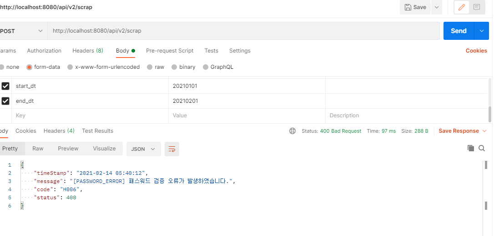

# :loudspeaker: 홈택스 예외처리
공인인증서 복호화시 오류나 홈택스 로그인시 오류에 대해 Exception 처리를  
유지보수나 추가 예외처리를 편하게 하기 위해 커스텀 예외처리 클래스를 구현해 보았다.  

먼저 예외 코드들에 대해 정의를 하기 위한 ErrorCode enum 클래스를 만들어준다.   
예외처리가 필요한 부분에 대해서 HttpSataus 코드와 "H001" 같은 자체 코드 그리고 예외 메세지를 정의해둔다.   

``` java
@Getter
public enum ErrorCode {
    /*  HttpSataus 상태 코드 정리
        400 : Bad Request, 요청이 부적절 할 때, 유효성 검증 실패, 필수 값 누락 등.
        401 : Unauthorized, 인증 실패, 로그인하지 않은 사용자 또는 권한 없는 사용자 처리
        402 : Payment Required
        403 : Forbidden, 인증 성공 그러나 자원에 대한 권한 없음. 삭제, 수정시 권한 없음.
        404 : org.aspectj.weaver.ast.Not Found, 요청한 URI에 대한 리소스 없을 때 사용.
        405 : Method Not Allowed, 사용 불가능한 Method를 이용한 경우.
        406 : Not Acceptable, 요청된 리소스의 미디어 타입을 제공하지 못할 때 사용.
        408 : Request Timeout
        409 : Conflict, 리소스 상태에 위반되는 행위 시 사용.
        413 : Payload Too Large
        423 : Locked
        428 : Precondition Required
        429 : Too Many Requests
        500 : 서버 에러
    */
    SUCCESS(200, "200", "success" )
    , BAD_REQUEST(401,"401","BAD_REQUEST")
    , SYSTEM_ERROR(500 , "500", "SYSTEM_ERROR")
    , SIGN_PRI_NOT_FOUND(400 , "H001", "[SIGN_PRI_NOT_FOUND] 공인인증서 signPri.key 파일은 필수입니다.")
    , SIGN_CERT_NOT_FOUND(400 , "H002", "[SIGN_CERT_NOT_FOUND] 공인인증서 signCert.key 파일은 필수입니다.")
    , PASSWORD_NOT_FOUND(400 , "H003", "[PASSWORD_NOT_FOUND] 공인인증서 패스워드는 필수입니다.")
    , SIGN_PRI_EXTENSION_ERROR(400 , "H004", "[SIGN_PRI_EXTENSION_ERROR] 공인인증서 signPir 파일의 확장자가 잘못되었습니다.")
    , SIGN_CERT_EXTENSION_ERROR(400 , "H005", "[SIGN_CERT_EXTENSION_ERROR] 공인인증서 signCert 파일의 확장자가 잘못되었습니다..")
    , PASSWORD_ERROR(400 , "H006", "[PASSWORD_ERROR] 패스워드 검증 오류가 발생하였습니다.")
    , LOGIN_ERROR(400 , "H007", "[LOGIN_ERROR] 로그인 과정중 오류가 발생하였습니다.")
    , DECR_ERROR(400 , "H008", "[FILE_DECR_ERROR] 복호화 과정중 오류가 발생하였습니다.")
    , SEARCH_START_DATE(400 , "H009", "[SEARCH_START_DATE] 조회 시작일은 필수값입니다.")
    , SEARCH_END_DATE(400 , "H010", "[SEARCH_END_DATE] 조회 종료일은 필수값입니다.")
    ;

    private String message;
    private String code;
    private int status;

    private ErrorCode(int states , String code, String message) {
        this.code = code;
        this.message = message;
        this.status = states;
    }
}
```

그리고 예외처리시 Response 해 줄 클래스도 작성해줬다.

``` java
@Getter
public class ErrorResponse {

    private String timeStamp = LocalDateTime.now().format(DateTimeFormatter.ofPattern("yyyy-MM-dd HH:mm:ss"));
    private String message; // 예외 메세지
    private String code; // 커스텀 오류 코드
    private int status; // HTTP 상태값

    public ErrorResponse() {
    }

    static public ErrorResponse create() {
        return new ErrorResponse();
    }

    public ErrorResponse code(String code) {
        this.code = code;
        return this;
    }

    public ErrorResponse status(int status) {
        this.status = status;
        return this;
    }

    public ErrorResponse message(String message) {
        this.message = message;
        return this;
    }
}
```

우린 홈택스 관련 예외처리만을 해야하기때문에 추가로 Exception 클래스를 작성해준다.   
그리고 우리가 아직 발견하지 못한 공인인증서 만료라던가 이런 부분에 대해 홈택스 측에서 예외처리를 해주고 있다.   
그런 상황일때는 메세지를 그대로 노출시켜 사용자에게 제공하기 위해 메시지를 부모 객체에 접근하여 변경하여준다.   

``` java
public class HomeTaxException extends Exception{

    private static final long serialVersionUID = 1L;

    private ErrorCode errorCode;

    public HomeTaxException(ErrorCode errorCode) {
        super(errorCode.getMessage());
        this.errorCode = errorCode;
    }

    public HomeTaxException(ErrorCode errorCode, String message) {
        super(message);
        this.errorCode = errorCode;
    }

    public ErrorCode getErrorCode() {
        return errorCode;
    }

}
```

이제 CustomExceptionHandler 부분을 작성해야하는데 이전에 만들어둔 HomeTaxException 부분을 ExceptionHandler로 타겟 설정을 해준다.   
그러면 HomeTaxException으로 발생하는 Exception은 handleCustomException 부분에 걸려 해당 로직이 작동하게 된다.

``` java
@RestControllerAdvice
@Slf4j
public class CustomExceptionHandler {

    //HomeTaxException 을 상속받은 클래스가 예외를 발생 시킬 시, Catch하여 ErrorResponse를 반환한다.
    @ExceptionHandler(HomeTaxException.class)
    @Transactional
    protected ResponseEntity<ErrorResponse> handleCustomException(HomeTaxException e) {
        log.error("## CustomException", e);

        ErrorCode errorCode = e.getErrorCode();

        ErrorResponse response
                            = ErrorResponse
                            .create()
                            .status(errorCode.getStatus())
                            .code(errorCode.getCode())
                            .message(e.getMessage());

        return new ResponseEntity<>(response, HttpStatus.resolve(errorCode.getStatus()));
    }

    //모든 예외를 핸들링하여 ErrorResponse 형식으로 반환한다.
    @ExceptionHandler(Exception.class)
    protected ResponseEntity<ErrorResponse> handleException(Exception e) {
        log.error("## Exception ", e);

        ErrorResponse response
                = ErrorResponse
                .create()
                .status(HttpStatus.INTERNAL_SERVER_ERROR.value())
                .message(e.getMessage());

        return new ResponseEntity<>(response, HttpStatus.INTERNAL_SERVER_ERROR);
    }

}
```

이제 REST API 컨트롤러 쪽에 CustomExceptionHandler 클래스를 상속시키면 예외처리가 완성된다.   

POSTMAN으로 고의로 패스워드를 틀리게 입력하여 테스트를 진행해보자 :grinning:



정상적으로 예외 케이스에 필터링되서 정상 작동하는것을 확인할 수 있다. :thumbsup:
